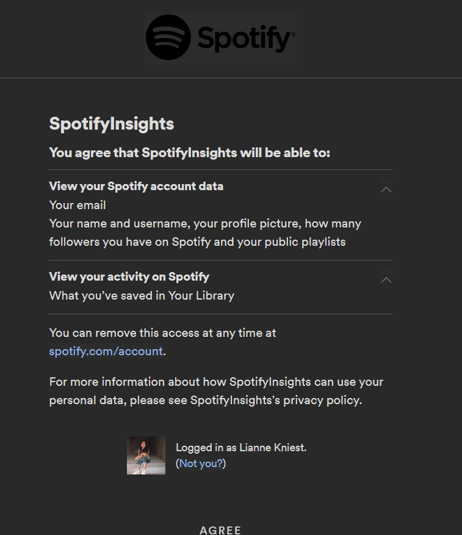

# Design Overview

An outline of the technical implementation of SpotifyInsights and the design process.

There are four main components of SpotifyInsights that have been implemented. Each class implemented will also be examined in detail below but the overall "components" are:

1. Web server implementation (done in Java)
    
    Consists of the Server.java file and the relevant html pages that are attatched to the domain and hosted by AWS.

2. Spotify OAuth login

    Handling the exchange of credentials with Spotify within the Server

3. JSON parsing framework

    Setting up a framework to allow songs to be requested from Spotify and the information interpreted by our app

4. Data analysis and graphical representation

    Creating a representation of the data from Spotify and creating meaningful analysis

## Files Created

### Server.java

This file is where all of "the magic" happens. 

This file creates an instance of the server to be run by the hosting service and accessed via the domain we purchased. It handles the OAuth by directing a client to Spotify web servers where they then login. Spotify then directs the client back to our server via our provided callback and provides us with an access token. The server then makes the relevant API requests to Spotify (current top tracks and the content of a user's "liked songs" library) and hands it to the Track class to get a parsed version of the information from the JSON recieved from the API request.

What the client login screen looks like to a client: 

### Webpages

#### Index

????

#### 404 page

Basic 404 not found page.

#### spotify_client_id

Stores our client id to prove identity to Spotify once the access token is recieved.

### Track.java

Stores the information of a Spotify track

This object handles the parsing of a track's information from the API and stores it into coder-friendly terms (takes the json and keeps items such as titles and artists as Strings or List<String>s).

## Design Process Timeline (and the decisions made)

Our project began first with a dilemna over how to accept user data. Spotify offers two main ways for a user to interact with his/her data: 

### Downloaded Data (GDPR):

Spotify allows a user to download the entire history of a user account that is still stored in their databases. It is separated into files like this:

 
The information contains all of a user's plays above a certain second threshold and stores how long it was played for, the song information, and the date and time of > the play.
 
It also stores a user's liked songs ("library") and his/her playlists. 

### OAuth/API Access

Spotify's OAuth system allows for exchange of a user's information in real time. The API allows requests for data that give more specific details about a songs (ie popularity, genre, date added to a playlist, etc) however it does not allow access to a user's overall play history. 

One analysis feature that Spotify gives within its API is a list of a user's favorite artists and tracks in the recent period of the API request.
 
Access to a user's data with the API is primarily limited to analyzing the content of their saved/playlisted songs since there is no access to the overall play history.

### Why we chose to go with OAuth

First and foremost, the downloaded data that comes with a GDPR release is not in a consistently indexed format. Depending on the amount of plays a user's account has, the account data may contain a variable amount of files and we ran into an issue with being able to parse out what exactly lands in certain files. This comes from the purpose of the GDPR data: it is for privacy and serves as simple numeration; meanwhile, the API is meant to be used real-time in tools.

> For example, there is a file named MyCarThing.json. We had issues determining what data was selected to go into there (we were not able to find a tie to songs played while Spotify was in "car mode").

For this reason, we decided to go with a format that had readily accessible documentation and a more standard format json format. This also lowered the barrier of entry for a user (being able to access our interpretation via a website vs. having to wait a month for a download data and then uploading it to a local install of our app).

### Creating the server

In creating the server, we chose to use Java to expand on the things we've learned this quarter. With this came a few challenges:

ajdflksdajasldjsadlfdksajflsad something about paths

### Creating a JSON Parser

We chose to use the org.json library as we've worked with it before.

We created the Track.java file to provide temporary storage and allow for a lightweight framework to interact with the API. Creating a robust index of all of the songs and entire library of a user would be resource-intensive so we decided to store data on a track-by-track basis as we need the data. The JSON parser is implemented within the Track class and has the Server class as a client. 

### How we chose what to give insight about

The Spotify API admittedly threw us a curveball in that it didn't provide a history of plays like we had expected (given the GDPR data). We pivoted to take advantage of the variety in a user's "liked songs" as these are indexable unlike play counts. We chose to give insight on the liked songs rather than a playlist since a "liked songs" library tends to span years as users don't tend to remove songs from it over time. 

In addition, we wanted to provide the client access to some metrics that aren't normally available to a user. We chose to take advantage of the "current top artsts and tracks" that Spotify indexes to provide the client a clearer picture of their current listning habits and possibly some insight into how Spotify creates their customized playlists (ie the For You, On Repeat, and Repeat Rewind playlists)

